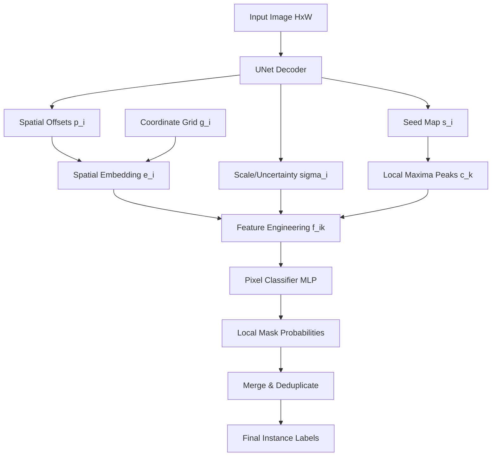

# InstanSeg Embeddings: Theoretical Foundation

This document provides a detailed theoretical and mathematical analysis of the spatial, scale, and seed embeddings used in the InstanSeg architecture for instance segmentation.

---

## Architecture Overview

InstanSeg is an instance segmentation model that uses a Fully Convolutional Network (FCN), such as a U-Net, to predict a low-dimensional embedding space. These predictions are transformed into scale-invariant relative features and classified using a small pixel classifier Multi-Layer Perceptron (MLP).

For a target segmentation task (e.g., cell segmentation), the U-Net outputs a tensor of shape $(C_{\text{out}}, H, W)$, where:

$$C_{\text{out}} = D_{\text{coords}} + N_{\sigma} + 1$$

Here, $D_{\text{coords}}$ is the spatial coordinate dimension (typically 2 for 2D images), $N_{\sigma}$ is the uncertainty/scale channel count (typically 1 or 4), and the final channel represents the instance seed map.

---

## 1. Normalized Grid Coordinates ($g_i$)

Before analyzing the model outputs, we define a static, non-learnable spatial coordinate grid $\mathbf{g}_i \in \mathbb{R}^2$ representing the physical location of pixel $i$:
$$\mathbf{g}_i = \begin{bmatrix} y_i \\ x_i \end{bmatrix}$$
These coordinate maps are pre-generated, normalized, and registered as a PyTorch buffer (`self.xxyy`) to provide a consistent spatial reference frame.

---

## 2. Spatial Embeddings ($\mathbf{e}_i$)

Let the raw model coordinate prediction at pixel $i$ be $\mathbf{p}_i = [p_{y,i}, p_{x,i}]^T \in \mathbb{R}^2$. The final spatial coordinate embedding $\mathbf{e}_i \in \mathbb{R}^2$ is obtained via one of two modes:

### A. Relative Offsets Mode (`to_centre = True`)
In this mode, the network predicts coordinate offsets that are directly added to the static grid coordinates:
$$\mathbf{e}_i = \mathbf{p}_i + \mathbf{g}_i$$
During training, the network learns to predict vectors $\mathbf{p}_i$ pointing from pixel $i$ directly to the centroid of the cell it belongs to.

### B. Bounded Sigmoid Mode (`to_centre = False`)
To stabilize training and prevent unbounded gradient updates, the offset coordinates can be squashed via a sigmoid function and scaled (typically by a factor of 8):
$$\mathbf{e}_i = 8 \cdot \left(\sigma_{\text{sigmoid}}(\mathbf{p}_i) - 0.5\right) + \mathbf{g}_i$$
This bounds the displacement vector $\mathbf{e}_i - \mathbf{g}_i$ to the range $[-4, 4]$ pixels, ensuring that pixels only map to centers within their local neighborhood.

---

## 3. Scale/Uncertainty Embeddings ($\boldsymbol{\sigma}_i$)

The network outputs a scale parameter $\boldsymbol{\sigma}_i \in \mathbb{R}^{N_{\sigma}}$ at each pixel $i$. 

### Theoretical Role
The scale parameter plays a dual role:
1. **Uncertainty Modeling:** It represents the model's confidence in its coordinate offset predictions. Pixels near cell boundaries or in crowded areas exhibit higher coordinate variance, resulting in larger $\boldsymbol{\sigma}_i$ values.
2. **Scale Invariance:** It normalizes the relative distances computed during feature engineering. Dividing spatial distances by $\boldsymbol{\sigma}_i$ maps objects of varying physical sizes (e.g., small nuclei vs. large cytoplasm) into a uniform, size-invariant feature space.

---

## 4. Instance Seed Map ($s_i$)

The seed map $s_i \in \mathbb{R}$ acts as a confidence score indicating the proximity of pixel $i$ to an object center.

### Training Supervision
During training, the seed map is supervised using a Binary Cross-Entropy (BCE) loss or an $L_1$ loss against a target Euclidean Distance Transform (EDT) map of the ground truth instances:
$$L_{\text{seed}} = \mathcal{L}\left(s_i, \text{EDT}(i)\right)$$
This forces the seed map to peak at the centers of cells and decay towards the background boundaries.

### Peak Detection
During postprocessing, candidate instance centers $\{\mathbf{c}_k\}$ are extracted by finding local maxima on the seed map:
$$\mathbf{c}_k = \text{local\_max}(S)$$
where $S$ is the thresholded seed map.

---

## 5. Feature Engineering and Instance Classification

For each identified candidate center $\mathbf{c}_k$, a local patch of size $W_c \times W_c$ is cropped. For each pixel $i$ inside the crop window around centroid $\mathbf{c}_k$, the engineered feature vector $\mathbf{f}_{i, k}$ is computed using one of the following methods:

### Standard Feature Engineering (Modes `"0"` and `"7"`)
This mode computes the difference between the pixel spatial embedding and the centroid embedding, and concatenates the pixel scale $\boldsymbol{\sigma}_i$:
$$\mathbf{f}_{i, k} = \begin{bmatrix} \mathbf{e}_i - \mathbf{e}_{\mathbf{c}_k} \\ \boldsymbol{\sigma}_i \end{bmatrix}$$
where $\mathbf{e}_{\mathbf{c}_k}$ is the coordinate embedding evaluated at the centroid $\mathbf{c}_k$:
- If `to_centre = True`, $\mathbf{e}_{\mathbf{c}_k} = \mathbf{g}_{\mathbf{c}_k}$ (the grid coordinates of the center).
- If `to_centre = False`, $\mathbf{e}_{\mathbf{c}_k} = \mathbf{e}(\mathbf{g}_{\mathbf{c}_k})$ (the predicted spatial embedding at the center).

### Distance Norm Feature Engineering (Mode `"2"`)
This mode appends the Euclidean $L_2$ distance norm to the feature vector:
$$\mathbf{f}_{i, k} = \begin{bmatrix} \mathbf{e}_i - \mathbf{e}_{\mathbf{c}_k} \\ \boldsymbol{\sigma}_i \\ \|\mathbf{e}_i - \mathbf{e}_{\mathbf{c}_k}\|_2 \end{bmatrix}$$

### Scale-Ablated Feature Engineering (Mode `"3"`)
This mode zeroes out the uncertainty/scale channel, disabling scale normalization:
$$\mathbf{f}_{i, k} = \begin{bmatrix} \mathbf{e}_i - \mathbf{e}_{\mathbf{c}_k} \\ \mathbf{0} \end{bmatrix}$$

---

## 6. Pixel Classifier MLP

The engineered features $\mathbf{f}_{i, k}$ are fed into a small MLP pixel classifier $\Phi$ consisting of a series of $1\times 1$ convolutions or linear layers:
$$\hat{p}_{i, k} = \sigma_{\text{sigmoid}}\left(\Phi(\mathbf{f}_{i, k})\right)$$
where $\hat{p}_{i, k}$ is the predicted probability that pixel $i$ belongs to instance $k$.

Since the spatial features are relative to the centroid $\mathbf{c}_k$, the MLP learns a shared representation of "foreground shape" relative to its center, enabling robust and computationally efficient instance extraction.

---

## 7. Embedding Modes

Training now exposes an `embedding_mode` parameter. The accepted values are:

- `center-seed`: center-relative vectors with seed-based instance differentiation.
- `border-seed`: nearest-border vectors with seed-based instance differentiation.
- `center-cluster`: center-relative vectors with dense embedding clustering.
- `border-cluster`: nearest-border vectors with dense embedding clustering.
- `combined-center`: center and border vectors concatenated, with seed-based differentiation.
- `combined-cluster`: center and border vectors concatenated, with dense embedding clustering.

Invalid values raise `ValueError` before training starts. The parameter can be passed as a training override or set in YAML under `training.embedding_mode`.
